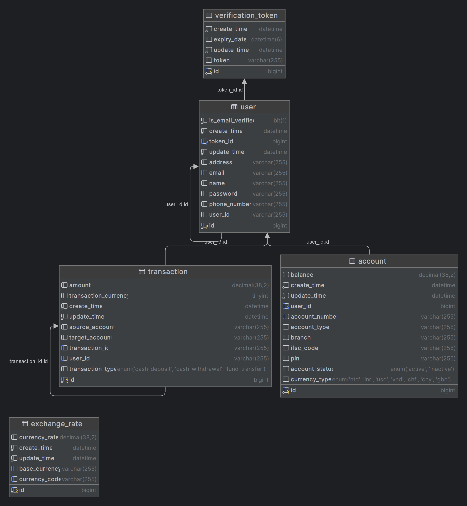
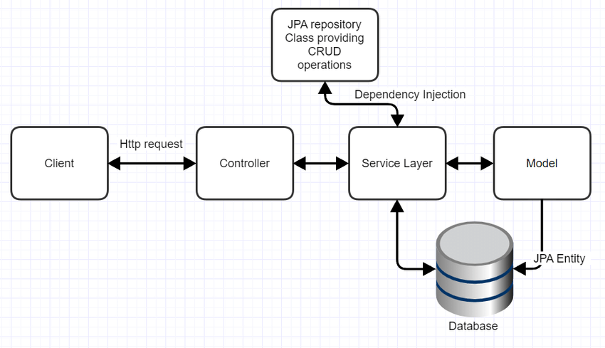

# Banking Portal

Welcome to the Banking Portal, a secure and modern banking application built with Spring Boot, Spring Security, Spring Kafka, MySQL, Docker, Java 17, and more.

## Table of Contents

- [Features](#features)
- [Entities](#entities)
- [APIs](#apis)
- [Unit Tests](#unit-tests)
- [Local Setup](#local-setup)
- [Docker Compose](#docker-compose)
- [Kubernetes Deployment](#kubernetes-deployment)
- [CircleCI Pipeline](#circleci-pipeline)
- [Entity Relationship Diagram](#er-diagram)
- [Project Architechture](#architechture)

## Features

- User Registration and Authentication
- PIN Management (Create, Update)
- Account Operations (Deposit, Withdrawal, Transfer)
- User Details Retrieval
- Transaction History
- Fetch Exchange rates from third party api

## Entities

- User
- Account
- ExchangeRate
- Transaction
- VerficationToken

## APIs

### Authentication

- `POST /users/register`: Register a new user.
- `POST /users/login`: Authenticate and generate a token.

### PIN Management

- `POST /account/pin/create`: Create a new PIN.
- `PUT /account/pin/update`: Update an existing PIN.
- `GET /account/pin?accountNumber=0b0e86edd089`: Update an existing PIN.
- `PATCH /account/pin/update`: Update an existing PIN.

### Account Operations

- `POST /account/deposit`: Cash deposit to an account.
- `POST /account/withdrawal`: Cash withdrawal from an account.
- `POST /account/transfer`: Fund transfer between accounts.
- `POST account/{userId}?currencyType=INR`: create new account for user.

### User Details

- `GET /users`: Retrieve user details.

### Transaction History

- `GET /dashboard/transactions?offset=0&pageSize=2&currency=VND`: Get all transactions of the loggedin user.

### Exchange rates

- `GET /exchange/fetch?baseCode=INR`: Get exhange rates from thrid party for given currency.

## Unit Tests

The project includes comprehensive unit tests written using JUnit 5 to ensure the reliability of the application.

## Local Setup

1. Clone the repository: `git clone https://github.com/patil-lab/banking-portal.git`
2. Navigate to the project directory: `cd banking-portal`
3. Run the application: `./mvnw spring-boot:run`

## Docker Compose

Use the provided `docker-compose.yml` file to run the application locally using Docker. Execute the following command:

```bash
docker-compose up
```
## Kubernetes Deployment

refer kubernetes_manifest.yaml for deplotment configuration

## CircleCI Pipeline

[Pipeline URL](https://app.circleci.com/pipelines/circleci/DVjy7FwFwMjZx7RGBVbTxc/7HNZsV94t7bhZPR4hW761L/3/workflows/e4da9726-f0f1-41f7-9371-e260771cf02a/jobs/2)

## Entity Relationship Diagram


```
```

## Project Architechture




